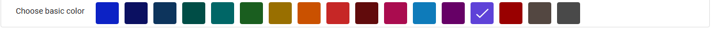
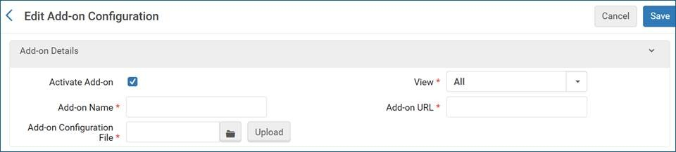
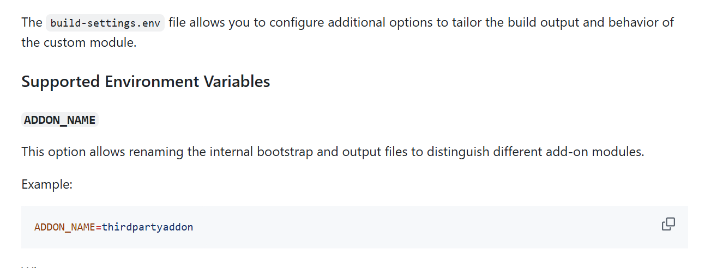
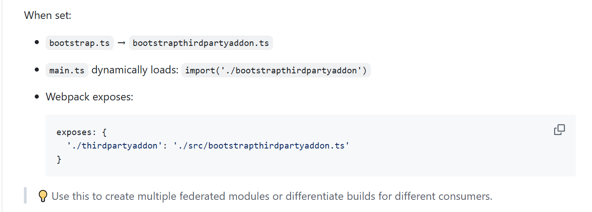
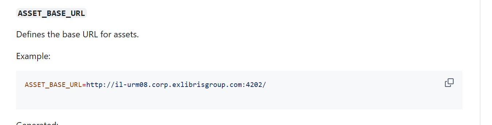

# CustomModule

### Overview
The NDE Customization package offers options to enhance and extend the functionality of Primo’s New Discovery Experience (NDE). You can add and develop your own components, customize theme templates, and tailor the discovery interface to your specific needs.

**Note:**
<mark>This branch includes updates and other improvements that will be compatible with the April 2025 release of NDE. We will merge this branch to the main one when it is compatible with released version of NDE.</mark>

**Note:**
The NDE Customization package is currently available exclusively to Primo customers who have early access to the New Discovery Experience (NDE). Further availability will be announced in upcoming releases.

---

## Prerequisites

### Node.js and npm (Node Package Manager)
1. **Verify Node.js and npm Installation:**
    - Open a terminal.
    - Run the following commands to check if Node.js and npm are installed:
        ```bash
        node -v
        npm -v
        ```
    - If installed, you will see version numbers. If not, you will see an error.

2. **Install Node.js and npm (if not installed):**
    - Visit the [Node.js download page](https://nodejs.org/en/download/).
    - Download the appropriate version for your operating system (npm is included with Node.js).
    - Follow the installation instructions.

### Angular CLI

1. **Verify Angular CLI Installation:**
    - Open a terminal.
    - Run the following command:
        ```bash
        ng version
        ```
    - If Angular CLI is installed, you will see the version and installed Angular packages.

2. **Install Angular CLI (if not installed):**
    - After installing Node.js and npm, install Angular CLI globally by running:
        ```bash
        npm install -g @angular/cli
        ```

---

## Development server setup and startup

### Step 1: Download the Project
1. Navigate to the GitHub repository: [https://github.com/ExLibrisGroup/customModule](https://github.com/ExLibrisGroup/customModule).
2. Download the ZIP file of the project.
3. Extract the ZIP file to your desired development folder (e.g., `c:\env\custom-module\`).

### Step 2: Install Dependencies
1. Inside the `customModule` directory, install the necessary npm packages:
    ```bash
    npm install
    ```

### Step 3: Configuring proxy for and starting local development server

There are two options for setting up your local development environment: configuring a proxy or using parameter on your NDE URL.

- **Option 1: Update `proxy.conf.mjs` Configuration**:
  - Set the URL of the server you want to test your code with by modifying the `proxy.conf.mjs` file in the `./proxy` directory:
    ```javascript
    // Configuration for the development proxy
    const environments = {
      'example': 'https://myPrimoVE.com',
    }

    export const PROXY_TARGET = environments['example'];
    ```
  - Start the development server with the configured proxy by running:
    ```bash
    npm run start:proxy
    ```
  - Open your browser on port 4201 to see your changes. e.g: http://localhost:4201/nde/home?vid=EXLDEV1_INST:NDE&lang=en

  
- **Option 2: Parameter on NDE URL**:
    - Start your development server by running
      ```bash
      npm run start
      ```
    -  Add the following query parameter to your NDE URL:
      ```
      useLocalCustomPackage=true
      ```
      For example: `https://sqa-na02.alma.exlibrisgroup.com/nde/home?vid=EXLDEV1_INST:NDE&useLocalCustomPackage=true`
    - This setting assumes that your local development environment is running on the default port `4201`.

  
---

## Code Scaffolding and Customization

### Step 4: Add Custom Components
1. Create custom components by running:
    ```bash
    ng generate component <ComponentName>
    ```
    Example:
    ```bash
    ng generate component RecommendationsComponent
    ``` 

2. Update `selectorComponentMap` in `customComponentMappings.ts` to connect the newly created components:
    ```typescript
    export const selectorComponentMap = new Map<string, any>([
      ['nde-recommendations-before', RecommendationsComponentBefore],
      ['nde-recommendations-after', RecommendationsComponentAfter],
      ['nde-recommendations-top', RecommendationsComponentTop],
      ['nde-recommendations-buttom', RecommendationsComponentButtom], 	  
      ['nde-recommendations', RecommendationsComponent],
      // Add more pairs as needed
    ]);
    ```

3. Customize the component’s `.html`, `.ts`, and `.scss` files as needed:
    - `src/app/recommendations-component/recommendations-component.component.html`
    - `src/app/recommendations-component/recommendations-component.component.ts`
    - `src/app/recommendations-component/recommendations-component.component.scss`


- All components in the NDE are intended to be customizable. However, if you encounter a component that does not support customization, please open a support case with us. This helps ensure that we can address the issue and potentially add customization support for that component in future updates.

### Accessing host component instance

You can get the instance of the component your custom component is hooked to by adding this property to your component class:

```angular2html
@Input() private hostComponent!: any;
```

### Accessing app state

- You can gain access to the app state which is stored on an NGRX store by injecting the Store service to your component:

```angular2html
private store = inject(Store);
```

- Create selectors. For example: 

```angular2html
const selectUserFeature = createFeatureSelector<{isLoggedIn: boolean}>('user');
const selectIsLoggedIn = createSelector(selectUserFeature, state => state.isLoggedIn);
```

- Apply selector to the store to get state as Signal:

```angular2html
isLoggedIn = this.store.selectSignal(selectIsLoggedIn);
```

Or as Observable:

```angular2html
isLoggedIn$ = this.store.select(selectIsLoggedIn);
```

### Translating from code tables 

You can translate codes in your custom component by using ngx-translate (https://github.com/ngx-translate/core).

- If you are using a stand alone component you will need to add the TranslateModule to your component imports list.
- In your components HTML you can translate a label like so:
```angular2html
<span>This is some translated code: {{'delivery.code.ext_not_restricted' | translate}}</span>
```


---

## Creating your own color theme

The NDE theming is based on Angular Material. 
We allow via the view configuration to choose between a number of pre built themes.




If you want to create your own theme instead of using one of our options follow these steps:

1. Create a material 3 theme by running:
    ```bash
    ng generate @angular/material:m3-theme
    ``` 
   You will be prompted to answer a number of questions like so:
  ```
? What HEX color should be used to generate the M3 theme? It will represent your primary color palette. (ex. #ffffff) #1eba18
? What HEX color should be used represent the secondary color palette? (Leave blank to use generated colors from Material)
? What HEX color should be used represent the tertiary color palette? (Leave blank to use generated colors from Material)
? What HEX color should be used represent the neutral color palette? (Leave blank to use generated colors from Material)
? What is the directory you want to place the generated theme file in? (Enter the relative path such as 'src/app/styles/' or leave blank to generate at your project root) src/app/styles/
? Do you want to use system-level variables in the theme? System-level variables make dynamic theming easier through CSS custom properties, but increase the bundle size. yes
? Choose light, dark, or both to generate the corresponding themes light

```
- Note that it is imporant to answer yes when asked if you want to use system-level variables.

- Also note that I'm only entering the primary color and not secondary or tertiary. They will be selected automatically based on my primary color.

Once this script completes successfully you will recieve this message: 

`CREATE src/app/styles/m3-theme.scss (2710 bytes)`

To apply the theme go to `_customized-theme.scss` and uncomment the following lines:
```
.custom-nde-theme{
  @include mat.all-component-colors(m3-theme.$light-theme);
  @include mat.system-level-colors(m3-theme.$light-theme);
}
```
---


## Developing an Add-On for the NDE UI

The NDE UI supports loading of custom modules at runtime and also provides infrastructure to dynamically load add-ons developed by vendors, consortia, or community members. This enables seamless integration, allowing institutions to configure and deploy external add-ons through **Add-On Configuration in Alma**.

The NDE UI add-on framework allows various stakeholders to develop and integrate custom functionality:

- **Vendors** can create and host services that institutions can seamlessly incorporate into their environment.
- **Institutions and consortia** can develop and share custom components, enabling consistency and collaboration across multiple libraries.

Library staff can easily add, configure, and manage these add-ons through Alma, following guidelines provided by the stakeholders. These typically include:

- **Add-on Name** – The identifier used in Alma’s configuration.
- **Add-on URL** – The location where the add-on is hosted (static folder to load the add-on at runtime).
- **Configuration Parameters** – JSON-based config parameters to be referenced at runtime by the add-on.



---

## Guidelines for Developing an Add-On

You can download the custom module and modify it to function as an add-on.

### Set Add-on Name

This section below should remain the same.





---

The add-on infrastructure provides a way to access institution-specific configuration parameters. Institutions can upload their configuration settings in JSON format, which your add-on can reference dynamically within its components.

### 🔧 Accessing Add-On Configuration Parameters

To access the module parameters from your configuration file, inject the `LookupService` in your component and use `getModuleParam()`:

```ts
constructor(private lookupService: LookupService) {}

ngOnInit() {
  const paramValue = this.lookupService.getModuleParam('yourParamKey');
}
```

> 📘 `yourParamKey` should match the keys defined in your Alma Add-on JSON configuration.

---

If your add-on includes assets such as images, you can ensure a complete separation between the frontend code and asset deployment. To achieve this, set `ASSET_BASE_URL` to point to your designated static folder, allowing your add-on to reference assets independently of the core application.




The `autoAssetSrc` directive automatically prepends `ASSET_BASE_URL` to your `[src]` attribute.

### Example:
```html

```

With:
```env
ASSET_BASE_URL=http://il-urm08.corp.exlibrisgroup.com:4202/
```

Results in:
```html

```

### Supported Elements:
- ``
- `<source>`
- `<video>`
- `<audio>`

> ✅ Always use `[src]="'relative/path'"` to ensure proper asset URL injection.

---


---

## Recommended Development Environment

To ensure smooth development, debugging, and code management, we recommend setting up your environment with the following tools:

### 🖥️ IDEs and Editors

- **Visual Studio Code (VSCode)** – Highly recommended  
  [Download VSCode](https://code.visualstudio.com/)
  - Recommended Extensions:
    - `Angular Language Service`
    - `ESLint` or `TSLint`
    - `Prettier - Code formatter`
    - `Path Intellisense`
    - `Material Icon Theme` (optional for better visuals)

- **WebStorm**  
  A powerful alternative with built-in Angular and TypeScript support.  
  [Download WebStorm](https://www.jetbrains.com/webstorm/)

- **IntelliJ IDEA**  
  A full-featured IDE by JetBrains. Ideal if you’re also working with Java backend.  
  [Download IntelliJ IDEA](https://www.jetbrains.com/idea/)

- **Eclipse IDE**  
  Suitable for full-stack development including Angular with the right plugins.  
  [Download Eclipse](https://www.eclipse.org/downloads/)

---

### 🔧 Tools & Utilities

- **Node Version Manager (nvm)**  
  Manage multiple versions of Node.js easily:
  ```bash
  curl -o- https://raw.githubusercontent.com/nvm-sh/nvm/v0.39.7/install.sh | bash
  ```

- **Angular CLI**
  ```bash
  npm install -g @angular/cli
  ```

- **Git GUI Clients**
  - GitHub Desktop
  - Sourcetree
  - GitKraken

---

### 🔍 Debugging & Testing

- Use **Chrome Developer Tools** for runtime inspection.
- Install **Augury Extension** (Angular DevTools) for inspecting Angular components.

---

### 🧪 Optional Tools

- **Postman** – For testing API requests.
- **Docker** – For isolated build environments.
- **Nx** – Monorepo tool (if planning multiple apps/libraries).

---
## Build the Project

### Step 5: Build the Project
1. Compile the project:
    ```bash
    npm run build
    ```

2. After a successful build, the compiled code will be in the `dist/` directory.


- **Automatic Packaging**:
  - The build process automatically compiles and packages the project into a ZIP file named according to the `INST_ID` and `VIEW_ID` specified in the `build-settings.env` file located at:
    ```
    C:\env\nde\customModule-base\build-settings.env
    ```
  - Example configuration:
    ```
    INST_ID=DEMO_INST
    VIEW_ID=Auto1
    ```
  - The ZIP file, e.g., `DEMO_INST-Auto1.zip`, is automatically created in the `dist/` directory after a successful build.


### Step 6: Upload Customization Package to Alma
1. In Alma, navigate to **Discovery > View List > Edit**.
2. Go to the **Manage Customization Package** tab.
3. Upload your zipped package in the **Customization Package** field and save.
4. Refresh the front-end to see your changes.


---

## Additional Resources

### Live Demo Tutorial
- **Customize Primo NDE UI**: Watch our live demo on YouTube for a visual guide on how to customize the Primo NDE UI:
  [Customize Primo NDE UI: Live Demo](https://www.youtube.com/watch?v=z06l2hJYuLc)


---

## Conclusion
By following these steps, you can customize and extend the NDE interface using the `CustomModule` package. If you have any questions or run into issues, refer to the project documentation or the ExLibris support.

